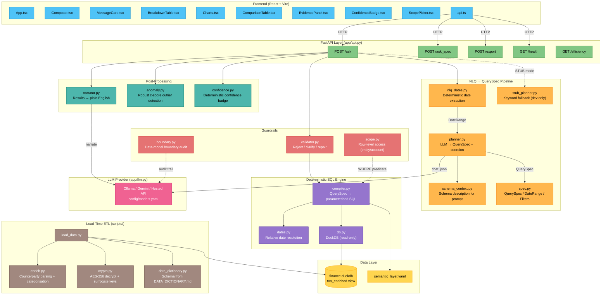

# Architecture Diagram

## Data Flow

```mermaid
sequenceDiagram
    participant User
    participant Frontend
    participant API as FastAPI
    participant NLQ as nlq_dates
    participant Plan as Planner
    participant LLM
    participant Val as Validator
    participant Comp as Compiler
    participant Duck as DuckDB
    participant Narr as Narrator
    participant Anom as Anomaly
    participant Conf as Confidence

    User->>Frontend: "How much did I spend last month?"
    Frontend->>API: POST /ask {question}

    API->>NLQ: extract dates deterministically
    NLQ-->>API: DateRange(relative, month, offset=-1)

    API->>Plan: plan_with_confidence(question)
    Plan->>LLM: chat_json(system_prompt, question)
    LLM-->>Plan: {dataset, metric, filters, group_by}
    Plan->>Plan: coerce() — fix small-model mistakes
    Plan-->>API: PlanResult(QuerySpec, confidence)

    API->>Val: validate(spec)
    Val->>Duck: check counterparty/category exist
    Val-->>API: Verdict(ok, repaired spec)

    API->>Comp: compile_sql(spec, anchor_date)
    Comp-->>API: parameterised SQL + params

    API->>Duck: run(sql, params)
    Duck-->>API: DataFrame (breakdown)

    API->>Comp: compile_evidence_sql(spec)
    API->>Duck: run(evidence_sql)
    Duck-->>API: DataFrame (evidence rows)

    API->>Narr: narrate(question, df, spec, window)
    Narr->>LLM: describe results in English
    LLM-->>Narr: narrative text
    Narr->>Narr: numeric_guard — verify no hallucinated numbers
    Narr-->>API: answer text

    API->>Anom: compile_anomaly_sql → run → from_scan
    Anom-->>API: anomaly flags

    API->>Conf: assess(spec, row_count, warnings)
    Conf-->>API: Assessment(level, reasons)

    API-->>Frontend: Answer JSON
    Frontend-->>User: Narration + breakdown + evidence + confidence badge
```

## Key Design Principles

| Principle | Implementation |
|---|---|
| **Model never sees data** | `boundary.py` audits every outbound call; model receives question + schema only |
| **Deterministic dates** | `nlq_dates.py` resolves "last month" before the LLM runs |
| **Coerce, then validate** | `planner.coerce()` fixes predictable small-model mistakes; `validator.py` checks against real data |
| **One repair, then refuse** | A second LLM failure becomes an honest refusal, never a guess |
| **Self-consistency confidence** | `plan_with_confidence` samples the planner N times; disagreement lowers the badge |
| **ETL, not per-query** | Counterparty parsing, categorisation, crypto, and anomaly stats run once at load time |
| **Semantic layer as contract** | `semantic_layer.yaml` is the single source of truth for datasets, metrics, dimensions |
