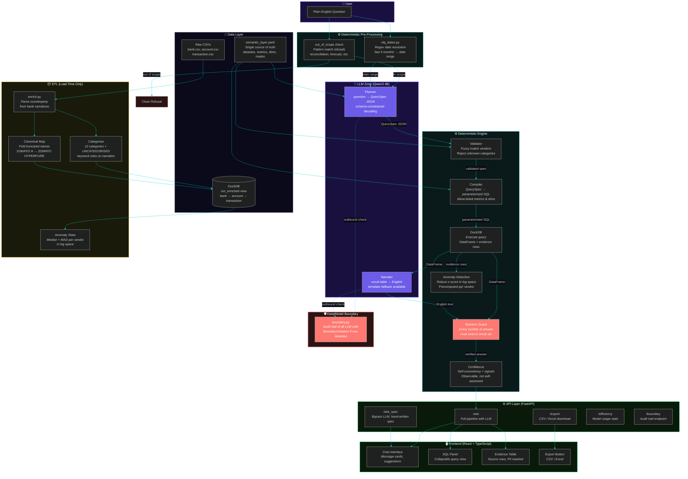

```mermaid
%%{init: {'theme': 'dark', 'themeVariables': { 'primaryColor': '#6c5ce7', 'primaryTextColor': '#f0f0ff', 'primaryBorderColor': '#6c5ce7', 'lineColor': '#00cec9', 'secondaryColor': '#12122a', 'tertiaryColor': '#1a1a3e', 'edgeLabelBackground': '#0a0a14', 'clusterBkg': '#12122a', 'clusterBorder': '#6c5ce7'}}}%%

flowchart TB
    subgraph USER["👤 User"]
        Q["Plain English Question"]
    end

    subgraph DETERMINISTIC_PRE["⚙️ Deterministic Pre-Processing"]
        NLQ["nlq_dates.py<br/><i>Regex date resolution</i><br/>'last 3 months' → date range"]
        OOS["out_of_scope check<br/><i>Pattern match refusals</i><br/>reconciliation, forecast, etc."]
    end

    subgraph LLM_ZONE["🤖 LLM Zone (Qwen3 4B)"]
        direction TB
        PLAN["Planner<br/><i>question → QuerySpec JSON</i><br/>schema-constrained decoding"]
        NAR["Narrator<br/><i>result table → English</i><br/>template fallback available"]
    end

    subgraph DETERMINISTIC_POST["⚙️ Deterministic Engine"]
        VAL["Validator<br/><i>Fuzzy match vendors</i><br/>Reject unknown categories"]
        COMP["Compiler<br/><i>QuerySpec → parameterised SQL</i><br/>Allow-listed metrics & dims"]
        DUCK["DuckDB<br/><i>Execute query</i><br/>DataFrame + evidence rows"]
        GUARD["Numeric Guard<br/><i>Every number in answer</i><br/>must exist in result set"]
        CONF["Confidence<br/><i>Self-consistency + signals</i><br/>Observable, not self-assessed"]
        ANOM["Anomaly Detection<br/><i>Robust z-score in log space</i><br/>Precomputed per vendor"]
    end

    subgraph ETL["📦 ETL (Load Time Only)"]
        ENRICH["enrich.py<br/><i>Parse counterparty</i><br/>from bank narrations"]
        CAT["Categorise<br/><i>12 categories + UNCATEGORISED</i><br/>keyword rules on narration"]
        CANON["Canonical Map<br/><i>Fold truncated names</i><br/>ZOMATO H → ZOMATO HYPERPURE"]
        STATS["Anomaly Stats<br/><i>Median + MAD per vendor</i><br/>in log space"]
    end

    subgraph DATA["💾 Data Layer"]
        SEM["semantic_layer.yaml<br/><i>Single source of truth</i><br/>datasets, metrics, dims, masks"]
        DB[("DuckDB<br/>txn_enriched view<br/>bank → account → transaction")]
        RAW["Raw CSVs<br/><i>bank.csv, account.csv</i><br/>transaction.csv"]
    end

    subgraph BOUNDARY["🛡️ Data/Model Boundary"]
        BND["boundary.py<br/><i>Audit trail of all LLM calls</i><br/>BoundaryViolation if row detected"]
    end

    subgraph API["🌐 API Layer (FastAPI)"]
        ASK["/ask<br/><i>Full pipeline with LLM</i>"]
        ASKSPEC["/ask_spec<br/><i>Bypass LLM, hand-written spec</i>"]
        EXP["/export<br/><i>CSV / Excel download</i>"]
        EFF["/efficiency<br/><i>Model usage stats</i>"]
        BNDEP["/boundary<br/><i>Audit trail endpoint</i>"]
    end

    subgraph UI["🖥️ Frontend (React + TypeScript)"]
        CHAT["Chat Interface<br/><i>Message cards, suggestions</i>"]
        SQLP["SQL Panel<br/><i>Collapsible query view</i>"]
        EVID["Evidence Table<br/><i>Source rows, PII masked</i>"]
        EXPB["Export Button<br/><i>CSV / Excel</i>"]
    end

    %% Main flow
    Q --> NLQ
    Q --> OOS
    OOS -->|"in scope"| PLAN
    OOS -->|"out of scope"| REFUSE["Clean Refusal"]
    NLQ -->|"date range"| PLAN
    PLAN -->|"QuerySpec JSON"| VAL
    VAL -->|"validated spec"| COMP
    COMP -->|"parameterised SQL"| DUCK
    DUCK -->|"DataFrame"| NAR
    DUCK -->|"DataFrame"| GUARD
    DUCK -->|"evidence rows"| ANOM
    NAR -->|"English text"| GUARD
    GUARD -->|"verified answer"| CONF
    CONF --> ASK

    %% Boundary enforcement
    PLAN -.->|"outbound check"| BND
    NAR -.->|"outbound check"| BND

    %% ETL flow
    RAW --> ENRICH
    ENRICH --> CAT
    ENRICH --> CANON
    CAT --> DB
    CANON --> DB
    DB --> STATS
    SEM --> COMP
    SEM --> VAL
    SEM --> PLAN

    %% API to UI
    ASK --> CHAT
    ASKSPEC --> CHAT
    ASK --> SQLP
    ASK --> EVID
    EXP --> EXPB

    %% Styling
    style LLM_ZONE fill:#1a1040,stroke:#6c5ce7,stroke-width:2px
    style BOUNDARY fill:#2a1515,stroke:#fd7972,stroke-width:2px
    style DETERMINISTIC_PRE fill:#0a1a1a,stroke:#00cec9,stroke-width:1px
    style DETERMINISTIC_POST fill:#0a1a1a,stroke:#00cec9,stroke-width:1px
    style ETL fill:#1a1a0a,stroke:#ffd32a,stroke-width:1px
    style DATA fill:#0a0a1a,stroke:#8888aa,stroke-width:1px
    style API fill:#0a1a0a,stroke:#00e676,stroke-width:1px
    style UI fill:#0a1a0a,stroke:#00e676,stroke-width:1px
    style USER fill:#1a1040,stroke:#6c5ce7,stroke-width:1px
    style REFUSE fill:#2a1515,stroke:#fd7972
    style PLAN fill:#6c5ce7,color:#fff
    style NAR fill:#6c5ce7,color:#fff
    style GUARD fill:#fd7972,color:#fff
    style BND fill:#fd7972,color:#fff
```
