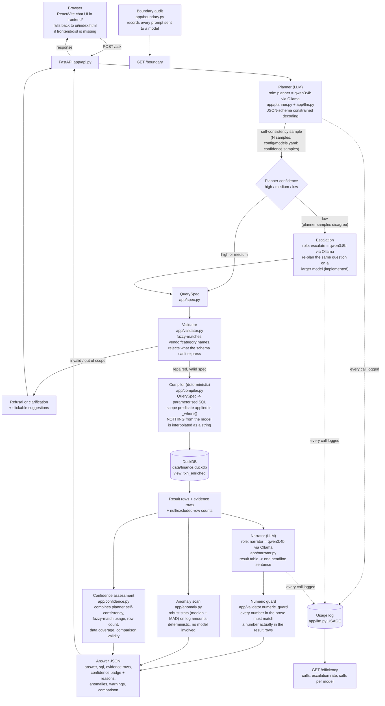
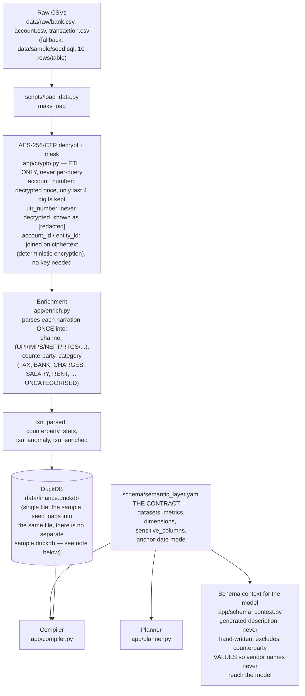
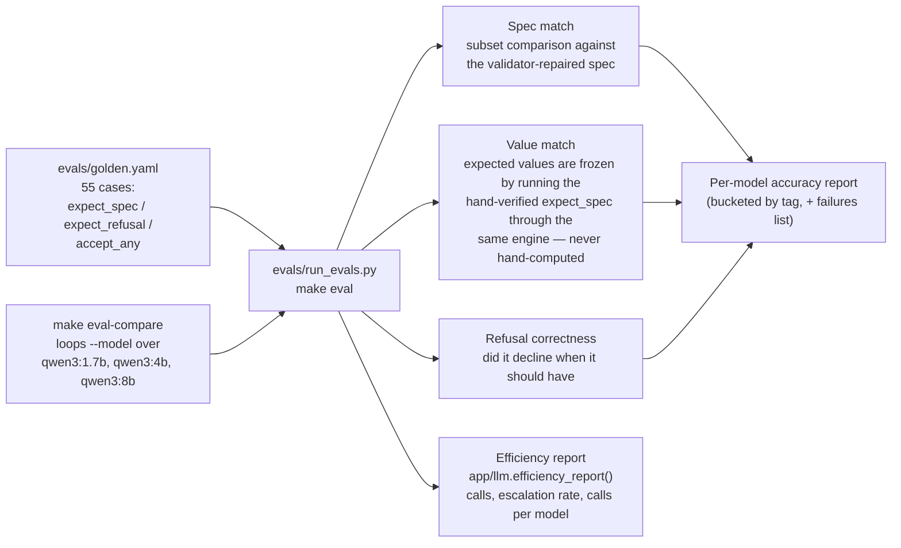

# Architecture

> For the full system graph and request sequence diagram see [../ARCHITECTURE.md](../ARCHITECTURE.md).

This is a natural-language finance Q&A assistant: a question in plain English
becomes a `QuerySpec` (a small, validated JSON contract), the `QuerySpec` is
compiled deterministically into parameterised SQL, DuckDB executes it, and a
second small model turns the result table into prose. The one rule that
shapes every box below: **the LLM never does arithmetic.** It only ever
translates intent into structure (planner) or a result table into a sentence
(narrator) — every number the user sees was computed by SQL, never by a model.
Everything runs against local Ollama models (`config/models.yaml` is the
single source of truth for which model plays which role), with DuckDB as the
query engine and `schema/semantic_layer.yaml` as the contract every layer
reads instead of hard-coding column names.

## 1. Request path

**Escalation:** When `plan_with_confidence()` in `app/planner.py` produces a
low-confidence result (planner samples disagree below `FINANCE_ESCALATE_THRESHOLD`,
default 0.6), or when the validator repair loop fails after one attempt, the system
re-plans the question against the `escalate` role (`qwen3:8b`, deliberately larger
than the planner's `qwen3:4b`). The escalated response is logged with `escalated=true`
and counted by `app/llm.efficiency_report()` for `/efficiency`. This can be disabled
with `FINANCE_ESCALATE=0`.

`/ask_spec` skips the planner and validator/compiler-onward path directly from
a hand-written `QuerySpec`, which is how the UI and eval harness work without
a model in the loop; `/export` runs the same validator → compiler → DuckDB
path and streams the breakdown as CSV/XLSX instead of narrating it.

## 2. ETL / data path

**Discrepancy found:** the task brief described a `data/sample/sample.duckdb`
fallback file. The code does not have that — `app/db.py` always points at
`data/finance.duckdb`, and the fallback (`data/sample/seed.sql`, 10 rows per
table per `DECISIONS.md`) is executed as SQL *into that same file* when
`data/raw/*.csv` is absent. There is no second `.duckdb` file. The diagram
above reflects the code.

## 3. Eval harness

## Component table

| Module | Responsibility | Key file |
|---|---|---|
| API surface | FastAPI endpoints (`/ask`, `/ask_spec`, `/export`, `/health`, `/scopes`, `/boundary`, `/efficiency`); serves `frontend/dist`, falling back to `ui/index.html` | `app/api.py` |
| Planner | NL question → `QuerySpec`; date extraction, coercion of small-model mistakes, one repair round-trip, self-consistency sampling for the confidence badge, out-of-scope/coverage refusals | `app/planner.py` |
| Model provider shim | Talks to Ollama's native `/api/chat` (or an OpenAI-compatible host/Gemini endpoint); enforces `config/models.yaml` roles and sampling params; JSON salvage (`chat_json`); append-only `USAGE` log behind `/efficiency` | `app/llm.py` |
| Confidence | Combines planner self-consistency, fuzzy-match usage, row count, unattributed-data coverage, and comparison-period validity into a `high/medium/low` badge with human-readable reasons | `app/confidence.py` |
| Contract | `QuerySpec` — the Pydantic model that is the interface between the model half and the data half of the system | `app/spec.py` |
| Compiler | `QuerySpec` → parameterised SQL; the single `_where()` choke point every query builder passes through, which is also where scope is enforced | `app/compiler.py` |
| Scope | Selector (`all` / `entity` / `account`) applied by the compiler after the model finishes; not part of `QuerySpec`, so the model cannot see, set, or widen it | `app/scope.py` |
| Validator | Rejects or clarifies before touching the database; fuzzy-matches vendor/category names against the real vocabulary; the numeric guard that checks narrated numbers against result rows | `app/validator.py` |
| DB connection | DuckDB connection management (one cursor per call, thread-safe), anchor-date resolution (data max vs. wall clock), ETL readiness checks for `/health` | `app/db.py` |
| Dates | Deterministic resolution of relative date ranges (`last month`, `this quarter`) anchored to the data's own max date | `app/dates.py` |
| NL date extraction | Regex-based extraction of date phrases from the raw question, run before the planner so the model never has to get dates right | `app/nlq_dates.py` |
| Enrichment | One-time ETL parsing of free-text narration into `channel`, `counterparty`, and `category`; the model never parses text at query time | `app/enrich.py` |
| Crypto | AES-256(-CTR) decrypt/mask, ETL-only; `account_number` masked to last 4 digits, `utr_number` never decrypted, ciphertext used directly as a deterministic join/group key | `app/crypto.py` |
| Data dictionary | Parses `schema/DATA_DICTIONARY.md` into DuckDB column types so the loader and `schema_check.py` cannot disagree about the schema | `app/data_dictionary.py` |
| Schema context | Generates the schema description sent to the planner from `semantic_layer.yaml`, deliberately excluding counterparty *values* so vendor names never reach the model | `app/schema_context.py` |
| Coverage allowlist | Checks every content word in the question maps to something the schema can express; the inverse of a blocklist, so out-of-scope concepts are named and refused rather than answered with the nearest valid query | `app/coverage.py` |
| Narrator | Turns a result table into one headline sentence; INR formatting; period-over-period phrasing | `app/narrator.py` |
| Anomaly detection | Deterministic robust-statistics (median + MAD on log amounts) flags for unusually large/small transactions per counterparty | `app/anomaly.py` |
| Boundary audit | Records every prompt sent to any model for `/boundary`; the auditable proof that the model never sees a database row directly | `app/boundary.py` |
| Stub planner | Keyword-rule planner behind `FINANCE_STUB_PLANNER=1`, for developing the UI/export/evidence path with no model running; always tags its output `STUB PLANNER` | `app/stub_planner.py` |
