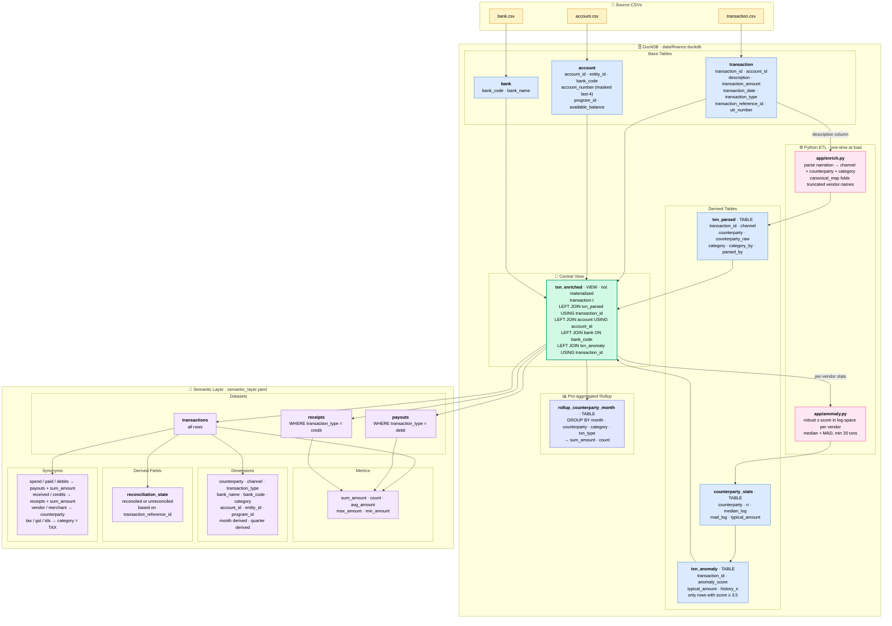

# Data Flow: Source Tables → Semantic Layer

```mermaid
flowchart TD
    subgraph Sources["📁 Source CSVs"]
        csv_bank["bank.csv"]
        csv_account["account.csv"]
        csv_transaction["transaction.csv"]
    end

    subgraph DuckDB["🗄️ DuckDB · data/finance.duckdb"]

        subgraph BaseTables["Base Tables"]
            bank["<b>bank</b><br/>bank_code · bank_name"]
            account["<b>account</b><br/>account_id · entity_id · bank_code<br/>account_number (masked last-4)<br/>program_id · available_balance"]
            transaction["<b>transaction</b><br/>transaction_id · account_id<br/>description · transaction_amount<br/>transaction_date · transaction_type<br/>transaction_reference_id · utr_number"]
        end

        subgraph Enrichment["⚙️ Python ETL · one-time at load"]
            enrich["<b>app/enrich.py</b><br/>parse narration → channel + counterparty + category<br/>canonical_map folds truncated vendor names"]
            anomaly["<b>app/anomaly.py</b><br/>robust z-score in log-space per vendor<br/>median + MAD, min 20 txns"]
        end

        subgraph DerivedTables["Derived Tables"]
            txn_parsed["<b>txn_parsed</b> · TABLE<br/>transaction_id · channel<br/>counterparty · counterparty_raw<br/>category · category_by · parsed_by"]
            cp_stats["<b>counterparty_stats</b> · TABLE<br/>counterparty · n · median_log<br/>mad_log · typical_amount"]
            txn_anomaly["<b>txn_anomaly</b> · TABLE<br/>transaction_id · anomaly_score<br/>typical_amount · history_n<br/>only rows with score ≥ 3.5"]
        end

        subgraph CentralView["🔗 Central View"]
            txn_enriched["<b>txn_enriched</b> · VIEW · not materialised<br/>transaction t<br/>LEFT JOIN txn_parsed USING transaction_id<br/>LEFT JOIN account USING account_id<br/>LEFT JOIN bank ON bank_code<br/>LEFT JOIN txn_anomaly USING transaction_id"]
        end

        subgraph Rollup["📊 Pre-aggregated Rollup"]
            rollup["<b>rollup_counterparty_month</b> · TABLE<br/>GROUP BY month · counterparty · category · txn_type<br/>→ sum_amount · count"]
        end
    end

    subgraph Semantic["📐 Semantic Layer · semantic_layer.yaml"]

        subgraph Datasets["Datasets"]
            ds_txn["<b>transactions</b><br/>all rows"]
            ds_pay["<b>payouts</b><br/>WHERE transaction_type = debit"]
            ds_rec["<b>receipts</b><br/>WHERE transaction_type = credit"]
        end

        subgraph Metrics["Metrics"]
            m["sum_amount · count · avg_amount<br/>max_amount · min_amount"]
        end

        subgraph Dimensions["Dimensions"]
            d["counterparty · channel · transaction_type<br/>bank_name · bank_code · category<br/>account_id · entity_id · program_id<br/>month derived · quarter derived"]
        end

        subgraph Derived["Derived Fields"]
            recon["<b>reconciliation_state</b><br/>reconciled or unreconciled<br/>based on transaction_reference_id"]
        end

        subgraph Synonyms["Synonyms"]
            syn["spend / paid / debits → payouts + sum_amount<br/>received / credits → receipts + sum_amount<br/>vendor / merchant → counterparty<br/>tax / gst / tds → category = TAX"]
        end
    end

    %% Source → Base Tables
    csv_bank --> bank
    csv_account --> account
    csv_transaction --> transaction

    %% Enrichment flow
    transaction -->|"description column"| enrich
    enrich --> txn_parsed
    txn_enriched -->|"per-vendor stats"| anomaly
    anomaly --> cp_stats
    cp_stats --> txn_anomaly

    %% View joins
    transaction --> txn_enriched
    txn_parsed --> txn_enriched
    account --> txn_enriched
    bank --> txn_enriched
    txn_anomaly --> txn_enriched

    %% View → downstream
    txn_enriched --> rollup
    txn_enriched --> ds_txn
    txn_enriched --> ds_pay
    txn_enriched --> ds_rec

    %% Semantic connections
    ds_txn --> m
    ds_pay --> m
    ds_rec --> m
    ds_txn --> d
    ds_txn --> recon
    ds_txn --> syn

    %% Styles
    classDef source fill:#fef3c7,stroke:#d97706,color:#000
    classDef table fill:#dbeafe,stroke:#2563eb,color:#000
    classDef etl fill:#fce7f3,stroke:#db2777,color:#000
    classDef view fill:#d1fae5,stroke:#059669,color:#000,stroke-width:2px
    classDef rollupStyle fill:#e0e7ff,stroke:#4f46e5,color:#000
    classDef semantic fill:#f3e8ff,stroke:#7c3aed,color:#000

    class csv_bank,csv_account,csv_transaction source
    class bank,account,transaction,txn_parsed,cp_stats,txn_anomaly table
    class enrich,anomaly etl
    class txn_enriched view
    class rollup rollupStyle
    class ds_txn,ds_pay,ds_rec,m,d,recon,syn semantic
```
